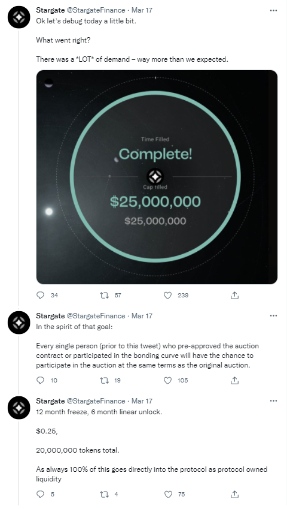
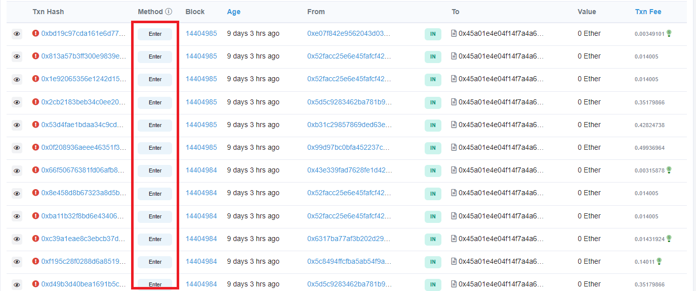

```python
import pandas as pd
tx_list = pd.read_csv('./auction_contract_transactions.csv')
```

## Introduction
19.537 ETH, or roughly $55,000 (at the time of the transactions). That is how much was spent in an attempt to be at the front of the line to purchase STG, [Stargate Finance's cross-chain ecosystem token](https://stargate.finance/). This piece will break down the three successful transactions that constituted the entire sale, as well as the activity from before and after. After reading it, you should walk away with an understanding for the strategy used by the frontrunner and some of the risks involved.

## Background 

The first public Stargate Finance token sale ended somewhat infamously with two addresses purchasing the entire $25 million reserve over three transactions, leaving nothing left for the thousands of others who were expecting to take part. It was later confirmed by Alameda Research CEO Sam Trabucco that the trading giant was the whale behind both accounts. 


While Alameda taking a 100\% position in your project is about as strong a vote of confidence as there is, it prompted the Stargate team to publicly reflect on the token sale design and eventually announce a second tranche for other users to purchase. This time, purchases by eligible accounts will be capped to [18,657 STG](https://twitter.com/StargateFinance/status/1506337292369149954).


## Contracts
There were two main contracts involved in the sale: [**StargateToken**](https://etherscan.io/token/0xaf5191b0de278c7286d6c7cc6ab6bb8a73ba2cd6) and [**Auction**](https://etherscan.io/address/0x45a01e4e04f14f7a4a6702c74187c5f6222033cd). Both are ERC-20's, with the former minting **STG** tokens and the latter minting **aSTG**. In [this transaction,](https://etherscan.io/tx/0x07d38a3b86c3bb97073ee920c70dade6c8b5eaea8629d2ef1c0510bf7ca0d181), `Auction` had 100,000,000 STG transferred to it to fund redemptions after the lockup period.

**Auction** has two key functions: `enter()` and `redeem()`. Just by looking at the names, it should be apparent that `enter()` was the main function that people would be interacting with. But it can be confirmed in hindsight by looking at the auction function history on Etherscan.



The relevant parts of the code are below:

```
uint astgDecimals // 6
uint public auctionStartTime; // 1647532800, or March 17, 2022 at 4pm UTC
uint public auctionCap; // 25000000000000, or 25,000,000 tokens at astgDecimals()

function enter(uint _amount) external {
    require(block.timestamp >= auctionStartTime, "auction not started");
    require(block.timestamp < auctionEndTime && auctionedAmount < auctionCap, "auction finished");
    require(_amount > 0, "amount too small");

    uint amount = _amount;
    uint quota = auctionCap - auctionedAmount;
    if(amount > quota) {
        amount = quota;
    }

    stableCoin.safeTransferFrom(msg.sender, stargateTreasury, amount);
    auctionedAmount += amount;
    _mint(msg.sender, amount);

    emit Auctioned(msg.sender, amount);
}
```

The `require` statements only check that the auction has started, that the auction cap has not been reached, and that the amount of stableCoin the user is transferring is greater than zero. Those statements provide clues for to how to frontrun all other purchasers: first, ensure the transaction is in the first block greater or equal to `auctionStartTime`, and then ensure the transactions do not attempt to purchase more than the remaining auction amount.

The astute reader will note that while there were 100,000,000 STG funding the contract, only 25,000,000 aSTG were issued. Essentially, each aSTG is redeemable for four STG when the vesting period finishes, as cleverly accomplished in this line in the `redeem()` function:
```
uint stargateAmount = stgAuctionAmount * newSharesToRedeem / totalSupply(); // stgAuctionAmount == 100m, newSharesToRedeem == vested, totalSupply() == aSTG totalSupply, or 25,000,000
```

## Transactions - Before auctionStart
After having identified our contract of interest, we can analyze the transactions themselves. The first thing to notice is that there were 21 transactions that attempted to call the `Enter` function before the block with the correct timestamp had been mined. This was likely in case the block ended up taking a long time to mine. Note that there were only five addresses submitting transactions at this point. The two addresses that ended up winning had already spent 2.541666 and 2.179671 ETH, respectively, in gas fees at this point. They, in addition to a third address, appear to be spamming the same transaction six times each.


```python
before_auction = tx_list[['From','TxnFee(ETH)','UnixTimestamp','DateTime','Status']][(tx_list['UnixTimestamp'] < 1647532800) & (tx_list['Method'] == 'Enter')]
before_auction ## len(before_auction) == 21
```


<div>
<style scoped>
    .dataframe tbody tr th:only-of-type {
        vertical-align: middle;
    }

    .dataframe tbody tr th {
        vertical-align: top;
    }

    .dataframe thead th {
        text-align: right;
    }
</style>
<table border="1" class="dataframe">
  <thead>
    <tr style="text-align: right;">
      <th></th>
      <th>From</th>
      <th>TxnFee(ETH)</th>
      <th>UnixTimestamp</th>
      <th>DateTime</th>
      <th>Status</th>
    </tr>
  </thead>
  <tbody>
    <tr>
      <th>1</th>
      <td>0x3dca07e16b2becd3eb76a9f9ce240b525451f887</td>
      <td>0.012009</td>
      <td>1647532566</td>
      <td>3/17/2022 15:56</td>
      <td>Error(0)</td>
    </tr>
    <tr>
      <th>3</th>
      <td>0x3dca07e16b2becd3eb76a9f9ce240b525451f887</td>
      <td>0.012009</td>
      <td>1647532583</td>
      <td>3/17/2022 15:56</td>
      <td>Error(0)</td>
    </tr>
    <tr>
      <th>4</th>
      <td>0x52facc25e6e45fafcf420506e1d0f03028b7d6f7</td>
      <td>0.006177</td>
      <td>1647532638</td>
      <td>3/17/2022 15:57</td>
      <td>Error(0)</td>
    </tr>
    <tr>
      <th>5</th>
      <td>0x99d97bc0bfa452237c65b43e59fd0d9e7f2b3f0c</td>
      <td>0.423611</td>
      <td>1647532775</td>
      <td>3/17/2022 15:59</td>
      <td>Error(0)</td>
    </tr>
    <tr>
      <th>6</th>
      <td>0x99d97bc0bfa452237c65b43e59fd0d9e7f2b3f0c</td>
      <td>0.423611</td>
      <td>1647532775</td>
      <td>3/17/2022 15:59</td>
      <td>Error(0)</td>
    </tr>
    <tr>
      <th>7</th>
      <td>0x99d97bc0bfa452237c65b43e59fd0d9e7f2b3f0c</td>
      <td>0.423611</td>
      <td>1647532775</td>
      <td>3/17/2022 15:59</td>
      <td>Error(0)</td>
    </tr>
    <tr>
      <th>8</th>
      <td>0x99d97bc0bfa452237c65b43e59fd0d9e7f2b3f0c</td>
      <td>0.423611</td>
      <td>1647532775</td>
      <td>3/17/2022 15:59</td>
      <td>Error(0)</td>
    </tr>
    <tr>
      <th>9</th>
      <td>0x99d97bc0bfa452237c65b43e59fd0d9e7f2b3f0c</td>
      <td>0.423611</td>
      <td>1647532775</td>
      <td>3/17/2022 15:59</td>
      <td>Error(0)</td>
    </tr>
    <tr>
      <th>10</th>
      <td>0x99d97bc0bfa452237c65b43e59fd0d9e7f2b3f0c</td>
      <td>0.423611</td>
      <td>1647532775</td>
      <td>3/17/2022 15:59</td>
      <td>Error(0)</td>
    </tr>
    <tr>
      <th>11</th>
      <td>0xb31c29857869ded63ebd4e322b865ea9d6858530</td>
      <td>0.363279</td>
      <td>1647532775</td>
      <td>3/17/2022 15:59</td>
      <td>Error(0)</td>
    </tr>
    <tr>
      <th>12</th>
      <td>0xb31c29857869ded63ebd4e322b865ea9d6858530</td>
      <td>0.363279</td>
      <td>1647532775</td>
      <td>3/17/2022 15:59</td>
      <td>Error(0)</td>
    </tr>
    <tr>
      <th>13</th>
      <td>0xb31c29857869ded63ebd4e322b865ea9d6858530</td>
      <td>0.363279</td>
      <td>1647532775</td>
      <td>3/17/2022 15:59</td>
      <td>Error(0)</td>
    </tr>
    <tr>
      <th>14</th>
      <td>0xb31c29857869ded63ebd4e322b865ea9d6858530</td>
      <td>0.363279</td>
      <td>1647532775</td>
      <td>3/17/2022 15:59</td>
      <td>Error(0)</td>
    </tr>
    <tr>
      <th>15</th>
      <td>0xb31c29857869ded63ebd4e322b865ea9d6858530</td>
      <td>0.363279</td>
      <td>1647532775</td>
      <td>3/17/2022 15:59</td>
      <td>Error(0)</td>
    </tr>
    <tr>
      <th>16</th>
      <td>0xb31c29857869ded63ebd4e322b865ea9d6858530</td>
      <td>0.363279</td>
      <td>1647532775</td>
      <td>3/17/2022 15:59</td>
      <td>Error(0)</td>
    </tr>
    <tr>
      <th>17</th>
      <td>0x5d5c9283462ba781b9e83d794071a9d28921a6c3</td>
      <td>0.298428</td>
      <td>1647532775</td>
      <td>3/17/2022 15:59</td>
      <td>Error(0)</td>
    </tr>
    <tr>
      <th>18</th>
      <td>0x5d5c9283462ba781b9e83d794071a9d28921a6c3</td>
      <td>0.298428</td>
      <td>1647532775</td>
      <td>3/17/2022 15:59</td>
      <td>Error(0)</td>
    </tr>
    <tr>
      <th>19</th>
      <td>0x5d5c9283462ba781b9e83d794071a9d28921a6c3</td>
      <td>0.298428</td>
      <td>1647532775</td>
      <td>3/17/2022 15:59</td>
      <td>Error(0)</td>
    </tr>
    <tr>
      <th>20</th>
      <td>0x5d5c9283462ba781b9e83d794071a9d28921a6c3</td>
      <td>0.298428</td>
      <td>1647532775</td>
      <td>3/17/2022 15:59</td>
      <td>Error(0)</td>
    </tr>
    <tr>
      <th>21</th>
      <td>0x5d5c9283462ba781b9e83d794071a9d28921a6c3</td>
      <td>0.298428</td>
      <td>1647532775</td>
      <td>3/17/2022 15:59</td>
      <td>Error(0)</td>
    </tr>
    <tr>
      <th>22</th>
      <td>0x5d5c9283462ba781b9e83d794071a9d28921a6c3</td>
      <td>0.298428</td>
      <td>1647532775</td>
      <td>3/17/2022 15:59</td>
      <td>Error(0)</td>
    </tr>
  </tbody>
</table>
</div>


```python
before_auction_grouped = before_auction.groupby('From')
before_auction_grouped['TxnFee(ETH)'].sum().sort_values(ascending=False)
```


    From
    0x99d97bc0bfa452237c65b43e59fd0d9e7f2b3f0c    2.541666
    0xb31c29857869ded63ebd4e322b865ea9d6858530    2.179671
    0x5d5c9283462ba781b9e83d794071a9d28921a6c3    1.790567
    0x3dca07e16b2becd3eb76a9f9ce240b525451f887    0.024019
    0x52facc25e6e45fafcf420506e1d0f03028b7d6f7    0.006177
    Name: TxnFee(ETH), dtype: float64


## Transactions - First Block After auctionStart
With previous block finishing at [15:59:35](https://etherscan.io/block/14404982), the addresses did not want to take chances and started submitting very expensive transactions. Their strategy paid off, as the block 14404984 was mined at [16:00:26](https://etherscan.io/block/14404984). The gas prices paid were [15k Gwei](https://etherscan.io/tx/0x0f325c074177bdbf6fc39fb30e5d7ecbfc1fe4b068729c5715584ce7308c7540), [17k Gwei](https://etherscan.io/tx/0x199d1dbcae406224149dbb7c0cb84080b2ab96c93fabe48a41b1a5d823e08e39), and [17k Gwei](https://etherscan.io/tx/0x5e383ed1cba7bf060be149bc0b47915d0756bbd26cb859c83de3c1f344763121). This time, seven addresses were in the mix. Despite winning the auction, the same addresses still had pending transactions that were mined despite returning an error.

Overall, the winning transactions cost a 5.744 Ether to send.


```python
winning_transactions = tx_list[['From','TxnFee(ETH)']][(tx_list['Status'].isna()) & (tx_list['Method'] == 'Enter')]
winning_transactions.sum()
```


    From           0x99d97bc0bfa452237c65b43e59fd0d9e7f2b3f0c0x99...
    TxnFee(ETH)                                             5.744321
    dtype: object


The total amount of ETH spent trying to secure the auction was 8.788.


```python
first_block_after_start = tx_list[['From','Blockno','TxnFee(ETH)','UnixTimestamp','DateTime','Status']][(tx_list['UnixTimestamp'] >= 1647532800) & (tx_list['Blockno'] == 14404984) & (tx_list['Method'] == 'Enter')].sort_values('TxnFee(ETH)',ascending=False)
first_block_after_start.fillna('Confirmed')
```


<div>
<style scoped>
    .dataframe tbody tr th:only-of-type {
        vertical-align: middle;
    }

    .dataframe tbody tr th {
        vertical-align: top;
    }

    .dataframe thead th {
        text-align: right;
    }
</style>
<table border="1" class="dataframe">
  <thead>
    <tr style="text-align: right;">
      <th></th>
      <th>From</th>
      <th>Blockno</th>
      <th>TxnFee(ETH)</th>
      <th>UnixTimestamp</th>
      <th>DateTime</th>
      <th>Status</th>
    </tr>
  </thead>
  <tbody>
    <tr>
      <th>23</th>
      <td>0x99d97bc0bfa452237c65b43e59fd0d9e7f2b3f0c</td>
      <td>14404984</td>
      <td>2.710782</td>
      <td>1647532826</td>
      <td>3/17/2022 16:00</td>
      <td>Confirmed</td>
    </tr>
    <tr>
      <th>26</th>
      <td>0xb31c29857869ded63ebd4e322b865ea9d6858530</td>
      <td>14404984</td>
      <td>1.541165</td>
      <td>1647532826</td>
      <td>3/17/2022 16:00</td>
      <td>Confirmed</td>
    </tr>
    <tr>
      <th>24</th>
      <td>0x99d97bc0bfa452237c65b43e59fd0d9e7f2b3f0c</td>
      <td>14404984</td>
      <td>1.492373</td>
      <td>1647532826</td>
      <td>3/17/2022 16:00</td>
      <td>Confirmed</td>
    </tr>
    <tr>
      <th>25</th>
      <td>0x99d97bc0bfa452237c65b43e59fd0d9e7f2b3f0c</td>
      <td>14404984</td>
      <td>0.945906</td>
      <td>1647532826</td>
      <td>3/17/2022 16:00</td>
      <td>Error(0)</td>
    </tr>
    <tr>
      <th>27</th>
      <td>0xb31c29857869ded63ebd4e322b865ea9d6858530</td>
      <td>14404984</td>
      <td>0.428247</td>
      <td>1647532826</td>
      <td>3/17/2022 16:00</td>
      <td>Error(0)</td>
    </tr>
    <tr>
      <th>28</th>
      <td>0xb31c29857869ded63ebd4e322b865ea9d6858530</td>
      <td>14404984</td>
      <td>0.428247</td>
      <td>1647532826</td>
      <td>3/17/2022 16:00</td>
      <td>Error(0)</td>
    </tr>
    <tr>
      <th>29</th>
      <td>0x5d5c9283462ba781b9e83d794071a9d28921a6c3</td>
      <td>14404984</td>
      <td>0.351799</td>
      <td>1647532826</td>
      <td>3/17/2022 16:00</td>
      <td>Error(0)</td>
    </tr>
    <tr>
      <th>30</th>
      <td>0x5d5c9283462ba781b9e83d794071a9d28921a6c3</td>
      <td>14404984</td>
      <td>0.351799</td>
      <td>1647532826</td>
      <td>3/17/2022 16:00</td>
      <td>Error(0)</td>
    </tr>
    <tr>
      <th>31</th>
      <td>0x5d5c9283462ba781b9e83d794071a9d28921a6c3</td>
      <td>14404984</td>
      <td>0.351799</td>
      <td>1647532826</td>
      <td>3/17/2022 16:00</td>
      <td>Error(0)</td>
    </tr>
    <tr>
      <th>32</th>
      <td>0x5c8494ffcfba5ab54f9a812c2f3157fb07a974a5</td>
      <td>14404984</td>
      <td>0.140110</td>
      <td>1647532826</td>
      <td>3/17/2022 16:00</td>
      <td>Error(0)</td>
    </tr>
    <tr>
      <th>33</th>
      <td>0x6317ba77af3b202d29e85bdb8600194874648d54</td>
      <td>14404984</td>
      <td>0.014319</td>
      <td>1647532826</td>
      <td>3/17/2022 16:00</td>
      <td>Error(0)</td>
    </tr>
    <tr>
      <th>34</th>
      <td>0x52facc25e6e45fafcf420506e1d0f03028b7d6f7</td>
      <td>14404984</td>
      <td>0.014005</td>
      <td>1647532826</td>
      <td>3/17/2022 16:00</td>
      <td>Error(0)</td>
    </tr>
    <tr>
      <th>35</th>
      <td>0x52facc25e6e45fafcf420506e1d0f03028b7d6f7</td>
      <td>14404984</td>
      <td>0.014005</td>
      <td>1647532826</td>
      <td>3/17/2022 16:00</td>
      <td>Error(0)</td>
    </tr>
    <tr>
      <th>36</th>
      <td>0x43e339fad7628fe1d42c10415adf0cf7ffe14078</td>
      <td>14404984</td>
      <td>0.003159</td>
      <td>1647532826</td>
      <td>3/17/2022 16:00</td>
      <td>Error(0)</td>
    </tr>
  </tbody>
</table>
</div>


```python
first_block_after_start['TxnFee(ETH)'].sum()
```


    8.787715291999998


The rest of the transactions from the block are below. It appears that they scaled the Gwei limit down after the first three transactions. Some other actors tried a similar strategy of entering multiple transactions, but did not use high enough gas.


```python
first_block_after_start_grouped = first_block_after_start.groupby('From')
first_block_after_start_grouped['TxnFee(ETH)'].sum().sort_values(ascending=False)
```


    From
    0x99d97bc0bfa452237c65b43e59fd0d9e7f2b3f0c    5.149061
    0xb31c29857869ded63ebd4e322b865ea9d6858530    2.397660
    0x5d5c9283462ba781b9e83d794071a9d28921a6c3    1.055396
    0x5c8494ffcfba5ab54f9a812c2f3157fb07a974a5    0.140110
    0x52facc25e6e45fafcf420506e1d0f03028b7d6f7    0.028010
    0x6317ba77af3b202d29e85bdb8600194874648d54    0.014319
    0x43e339fad7628fe1d42c10415adf0cf7ffe14078    0.003159
    Name: TxnFee(ETH), dtype: float64


```python
first_block_after_start_grouped['From'].count().sort_values(ascending=False)
```


    From
    0x5d5c9283462ba781b9e83d794071a9d28921a6c3    3
    0x99d97bc0bfa452237c65b43e59fd0d9e7f2b3f0c    3
    0xb31c29857869ded63ebd4e322b865ea9d6858530    3
    0x52facc25e6e45fafcf420506e1d0f03028b7d6f7    2
    0x43e339fad7628fe1d42c10415adf0cf7ffe14078    1
    0x5c8494ffcfba5ab54f9a812c2f3157fb07a974a5    1
    0x6317ba77af3b202d29e85bdb8600194874648d54    1
    Name: From, dtype: int64


## Summary
In summary, it was a whale's auction, with the winners spending nearly 6 ETH to secure their position at the front of the line. In total, 19.57 ETH was given to miners in an attempt to purchase STG. Future auctions of the same design can be exploited in the same way, if you have the cash.


```python
tx_list['TxnFee(ETH)'].sum()
```


    19.569603508999997


